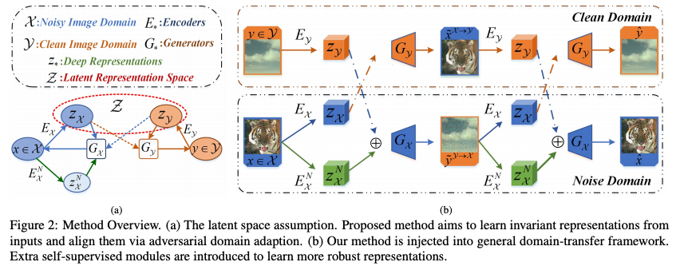

# Learning Invariant Representation for Unsupervised Image Restoration

Du, W., Chen, H. and Yang, H.  
In Proceedings of the IEEE/CVF Conference on Computer Vision and Pattern Recognition 2020.

## Main contribution
Learn disentangled intermediate representations of noise and content from noisy inputs
and reconstruct clean observations.

## Technical details
  

### Loss functions
1. $mathcal{L}$